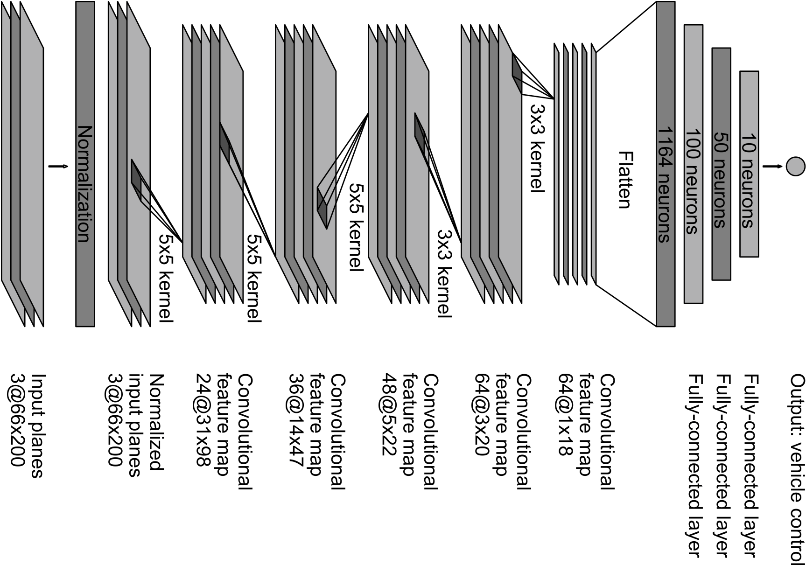
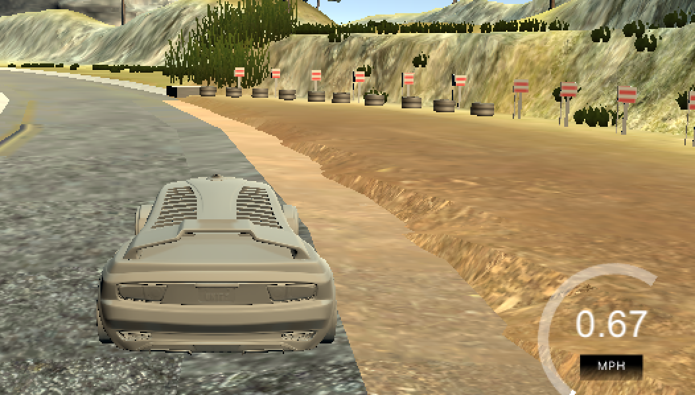
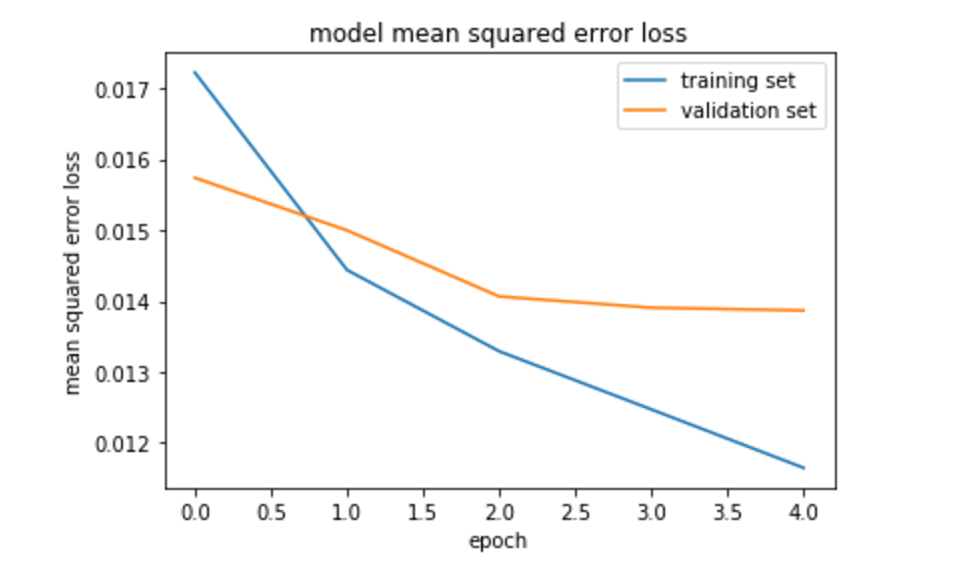

# **Behavioral Cloning** 

The goals / steps of this project are the following:

* Step 1: collecting trainig/validation data from driving simulator
* Step 2: data augmentation using left/right/flipped images and correcting steering angle 
* Step 3: using generators to iterate through the data on the fly instead of storing them in memory.
* Step 4: preprocessing data 
* Step 5: implementing NVIDIA architecture model to train the model
* Step 6: optimizing model with AdamOptimizer to minimize mean squared error
* Step 7: evaluating the model based on validation set
* Step 8: visualizing error loss of training and validation data to monitor over-fitting/under-fitting situations
* Step 9: saving the model and feeding it to drive.py to drive simulator in autonomous mode
* goal : achieving a high accuracy regression model to drive car simulator autonomously 

### Files Submitted & Code Quality

#### 1. Required files to run the simulator in autonomous mode

My project includes the following files:
* model.py containing the script to create and train the model
* drive.py for driving the car in autonomous mode
* models/ containing 2 models, model1.h5 is only trained on track1 with 30,000 data, model2.h5 is trained on 70,000 data track 1 & track 2
* writeup_report.md summary of the results

#### 2. Functional code

Using the Udacity provided simulator and my drive.py file, the car can be driven autonomously around the track by executing 
```sh
python drive.py models/model1.h5
python drive.py models/model2.h5
```

#### 3. Code is usable and readable

The model.py file contains the code for training and saving the convolution neural network. 

Running the model requires a `S3 bucket-name`, bucket should contain driving_log.csv and IMG folder with all images, as my model depends on reading images from S3. (Note: add aws secret keys to .aws/credentials)
```sh
python model.py -b bucket-name
```
model.py creates a folder with the bucket-name to download driving-log.csv , store model.h5 and loss plot.

### Model Architecture and Training Strategy

#### 1. Data Collection & Augmentation

Train-data for keeping the vehicle driving on the road are combination of these main categories: 
 * Driving 3 to 4 laps in the center of road on track #1 (both driving clockwise and counter-clockwise)
 * Recovery laps for only recording data when the car is driving from the side of the road back toward the center line
 * For each row of data in driving_log.csv , left and right image are also considered as a training data point with +/-0.2 steering angle correction
  * center image is also flipped with angle correction of -1x(steering-angle) of center image

For the 2nd model I also added track #2 to the dataset and increased the data to 70,000 frames.

#### 2. Model architecture

This model consists of 7 convolution neural network layers followed by 4 flat layers (including output layer)

* Collected data (sizes: model1 (32k), model2 (71k)) is splitted into training data/ validation data by `20%`, the data is normalized through a Lambda layer to fit in range [-0.5,0.5] before feeding into the first convoluitonal layer.
* Images are then cropped from `top(70px)` and `bottom(25px)` because these areas don't contain important information for training the model, it also helps reduce image size and network complexity.
* Conv Layer 1: applies `5x5` filter with `filter-depth=24`, it's subsampled (maxpool) and activated with a `RELU layer` to introduce nonlinearity.
* Conv Layers 2,3,4 & 5 follow simillar pattern to layer 1 but with deeper fitler size : `36`, `48` , `64` & `64`
* Flat Layer: outputs should be reshaped to flat as they are feeding a fully connected layer
* Dense Layer 1,2,3: fully connected layer consist of `100` & `50` & `10` nodes



Model uses `Adam optimizer` with `5 epochs` and `batch_size:32`

#### 3. Attempts to reduce overfitting in the model

The model contains `dropout layers` 50% in order to reduce overfitting and it's trained and validated on different data sets to ensure that the model was not overfitting. I tested my model by running it through the simulator and ensuring that the vehicle could stay on the track.

#### 4. Model parameter tuning

The model used an adam optimizer, so the learning rate was not tuned manually.

#### 5. Solution Design Approach

I started training my model using NVIDIA architecture without dropout layers with the data that I collected from track #1, incorporating left/right images with +/-0.2 correction and flipped-image with opposite steering angle helped car to stay almost in the center of lanes for the total of ~20k data. But my model needed more tuning for the road-turns as well as the sections of road with no lanes on the sides, such as :



As suggested in project description, I added recovery laps to my data-set (increased sized to ~30k) by recording how car should return to the center and adjust steering angels and my model managed to stay in the center even in all turns.
Here is the MSE loss of the model without dropout layers:



I noticed an interesting behavior on `frame-capture` timing and how network can be challenged on higher `speeds`! As speed increases simulator has less time to capture frames and model should be very accurate at the time of prediction otherwise car keeps going far left or right instead of keeping it in the middle.

So I increased the speed of the car in drive.py from `9mph to 20mph` and model was not doing very well, it was constantly changing steering angels to saty on track. I interpreted this behavior as my model wasn't predicting accurate enough and that's causing the car to get far off left/right in between camera captures. I then added dropout layers and here is the MSE loss of my 1st model after adding dropouts:
[IMAGE]

Adding dropout 50% in between all my fully connected layers to generalize model and the loss dropped very much, model performed a lot better with higher engine speed (20mph).

After getting good results on my 1st model, I started training my `2nd model` on ~70k data of both tracks (same architecture as my 1st model) to test how it performs on the 2nd track. I noticed massive improvement on this model (model2.h5) comparing it to my smaller model (model1.h5) especially in high-speed mode.

This huge amount of data didn't fit in an EC2 instance, so I uploaded them to a S3 bucket to eliminate memory restriction. Although it enabled me to train the model with more data, it slowed down my model training-time significantly becuase of reading each image from s3 bucket.

Using jupyter was a bad mistake, it filled up all of my server's memory and couldn't resolve it, so I ended up just running a python script rather than keeping it in jupyter notebook.

#### 6. Recorded video

I first recorded two laps on track #1 one using my first `model1.h5` and 1 lap on track #2 using my 2nd model `model2.h5`.

#### 7. Future works

Memory restriction is a huge problem on a long term training and I'd like to know more options other than s3 bucket. Also, I'm interested to know how we can incorporate speed into the model and combine steering angle with speed.

